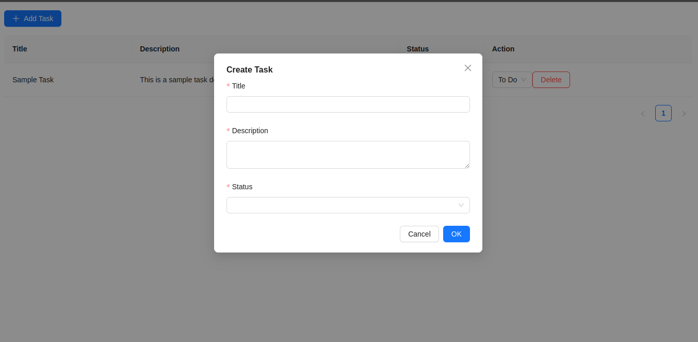

# Task Management CRUD Application

This is a **Task Management CRUD Application** built with **React**, **Redux Toolkit (RTK) Query**, **Ant Design**, and **Tailwind CSS**. It allows users to create, read, update, and delete tasks. The backend is built with **NestJS**, and the frontend is bootstrapped with **Vite**.

---

## Features

- **Create Tasks**: Add new tasks with a title, description, and status.
- **Read Tasks**: View all tasks in a table or fetch a single task by ID.
- **Update Tasks**: Modify the status of existing tasks.
- **Delete Tasks**: Remove tasks from the list.

---

## Technologies Used

- **Frontend**:

  - React
  - Redux Toolkit (RTK) Query for state management
  - Ant Design for UI components
  - Tailwind CSS for styling
  - Vite for development and bundling

---

## Libraries and Resources

- **Ant Design**: Used for pre-built UI components like tables, forms, and modals. [Ant Design Documentation](https://ant.design/docs/react/introduce)
- **Vite**: Used for fast development and bundling. [Vite Documentation](https://vitejs.dev/guide/)
- **Redux Toolkit (RTK) Query**: Used for managing API state and caching. [RTK Query Documentation](https://redux-toolkit.js.org/rtk-query/overview)
- **DeepSeek**: Used for guidance and troubleshooting during development.

---

## Screenshot

